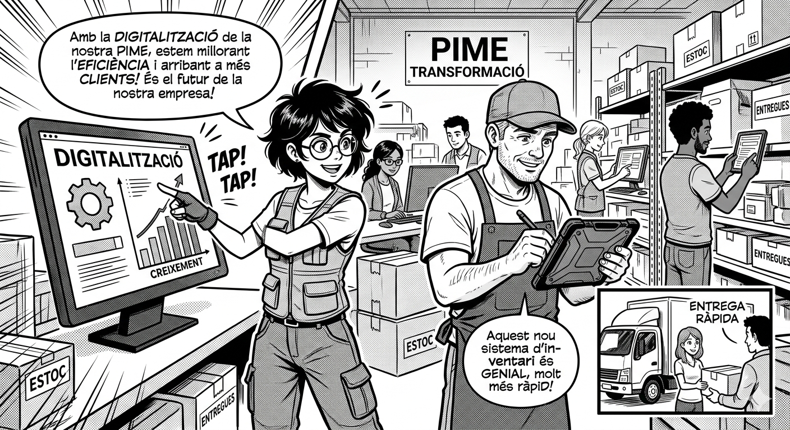

# Projecte 8

## Taula de continguts

- [Introducció al cas](#introducció-al-cas)
- [Competències professionals](Comp.md)
- [Resultats d'aprenentatge](RAs.md)
- [Resultats d'aprenentatge de CPS](CPS.md)
- [Tasques a realitzar](#tasques-a-realitzar)

---

## Introducció al cas

Lorem ipsum dolor sit amet, consectetur adipiscing elit. Aliquam molestie ligula a velit fringilla aliquam. Maecenas risus libero, egestas vitae lacinia id, eleifend tempor massa. Nulla non sapien et sem tincidunt pulvinar. Suspendisse id dui id neque dictum malesuada vitae in magna. Class aptent taciti sociosqu ad litora torquent per conubia nostra, per inceptos himenaeos. Maecenas purus lorem, varius vel tempus convallis, facilisis a turpis. Quisque euismod nisl odio. Proin suscipit tellus lorem, non commodo arcu hendrerit a. Donec quis facilisis mi. Pellentesque habitant morbi tristique senectus et netus et malesuada fames ac turpis egestas. Integer in velit a lorem dapibus molestie quis sed lectus. Etiam at facilisis erat. Ut sagittis pretium dolor quis laoreet. Nulla facilisi. Aliquam lacinia ullamcorper imperdiet.



## Tasques a realitzar

### Tasca 1: analitzar les necessitats de digitalització del client i elaborar un pla de transformació digital.

Diferents pimes volen impulsar el seu negoci a través de la digitalització, però no saben per on començar. El teu equip ha de realitzar una anàlisi exhaustiva de les necessitats de digitalització del client i elaborar un pla de transformació digital que inclogui les següents etapes:

```mermaid
graph TD
    A["Anàlisi de l'estat actual<br/>Avaluar tecnologies i processos per identificar àrees de millora."] 
    --> B["Definició d'objectius<br/>Establir fites clares i mesurables alineades amb el client."]
    
    B --> C[Selecció de tecnologies<br/>Identificar eines adequades segons necessitats i pressupost."]

    %% Estils per millorar la visualització
    style A stroke:#333,stroke-width:2px
    style B stroke:#333,stroke-width:2px
    style C stroke:#333,stroke-width:2px
```

El professorat us indicarà a cada equip el client específic que hauràs d'analitzar.

#### Llistat clients:

- [Client 1: cafeteria "El Racó del Cafè"](enunciats/client1.md)
- [Client 2: TransRàpid S.L.](enunciats/client2.md)
- [Client 3:](enunciats/client3.md)
- [Client 4:](enunciats/client4.md)

### Tasca 2: elaborar el pla de sostenibilitat per xxx


## Lliurament del projecte

Cliqueu sobre l'enllaç corresponent a la vostra classe:

- SMX 2n A [enllaç]()
- SMX 2n B [enllaç]()

A la pàgina `README.md` completeu les dades que es demanen. Crear les carpetes corresponents a les tasques demanades i a dins crear un `README.md` presentant l'activitat i un arxiu `solucio.md` amb la solució elaborada.

Les imatges que s'incorporin han d'estar dins una carpeta /img i si els diagrames, esquemes, etc. feu servir el format `mermaid`.