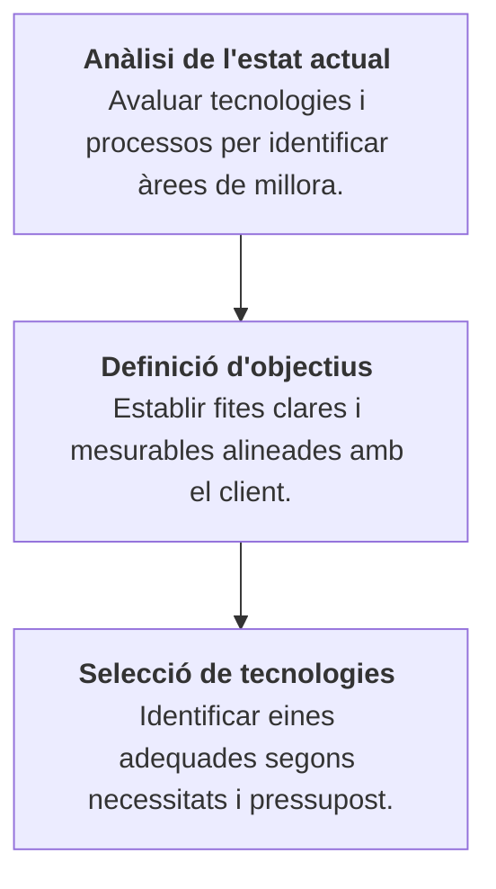

# Tasca 01. Analitzar necessitats clients

## Descripció

Diferents pimes volen impulsar el seu negoci a través de la digitalització, però no saben per on començar. El teu equip ha de realitzar una anàlisi exhaustiva de les necessitats de digitalització del client i elaborar un pla de transformació digital que inclogui les següents etapes:

El professorat us indicarà a cada equip el client específic que hauràs d'analitzar.

### Llistat clients

- [Client 1: Cafeteria "El Racó del Cafè"](/enunciats/client1.md)
- [Client 2: TransRàpid S.L.](/enunciats/client2.md)
- [Client 3: Aula de Formació per ONG](/enunciats/client3.md)
- [Client 4: "Fruits de la terra"](/enunciats/client4.md)

## Objectius específics / Finalitat de la tasca

Elaborar un pla de transformació digital per a una pime, que inclogui una anàlisi de l'estat actual, la definició d'objectius i la selecció de tecnologies adequades.

## Competències treballades

k) Elaborar pressupostos de sistemes a mida complint els requeriments del client.

l) Assessorar i assistir al client, canalitzant a un nivell superior els supòsits que ho requereixin per trobar solucions adequades a les necessitats d’aquest.

o) Utilitzar els mitjans de consulta disponibles, seleccionant-ne el més adequat en cada cas, per resoldre en temps raonable supòsits no coneguts i dubtes professionals.

## Resultats d'aprenentatge de la tasca

1713.RA2 Planteja solucions a les necessitats del sector tenint en compte la seva viabilitat, els costos associats i elaborant un petit projecte.

## Criteris d'avaluació de la tasca

2.1 Identifica les necessitats.

2.2 Planteja en grup possibles solucions.

2.3 Obté la informació relativa a les solucions plantejades.

2.4 Identifica aspectes innovadors que puguin ser d'aplicació.

2.5 Realitza l'estudi de viabilitat tècnica.

2.6 Identifica les parts que componen el projecte.

2.7 Preveu els recursos materials i humans per realitzar-lo.

2.8 Realitza el pressupost econòmic corresponent.

2.9 Defineix i elabora la documentació per al seu disseny.

2.10 Identifica els aspectes relacionats amb la qualitat del projecte.

## Continguts de la tasca

- Selecció de tecnologies digitals en funció de les necessitats del client.
- Elaboració de pressupostos de sistemes a mida complint els requeriments del client.

## Capacitats clau

| Autonomia | Organització del treball | Treball en equip |
| :--- | :--- | :--- |
| Innovació | Responsabilitat | ~~Resolució de problemes~~ |
| Relació Interpersonal | | |

## Distribució horària

Durada prevista: 8 hores.
Assignació horària: 8h RA2 Projecte Intermodular.

## Quan es necessita, termini i forma de lliurament

- Producte final: informe tècnic.
- Termini lliurament: abans data finalitació del projecte.
- Lliurar la tasca al repositori de projecte.
