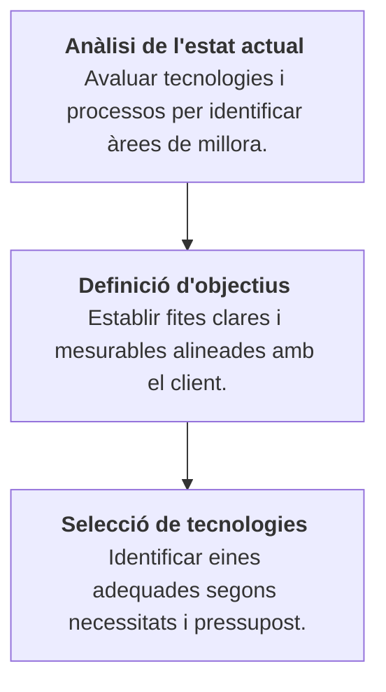

# Tasca 01. Analitzar necessitats clients

## Descripció

Diferents pimes volen impulsar el seu negoci a través de la digitalització, però no saben per on començar. El teu equip ha de realitzar una anàlisi exhaustiva de les necessitats de digitalització del client i elaborar un pla de transformació digital que inclogui les següents etapes:

El professorat us indicarà a cada equip el client específic que hauràs d'analitzar.

### Llistat clients

- [Client 1: cafeteria "El Racó del Cafè"](/enunciats/client1.md)
- [Client 2: TransRàpid S.L.](/enunciats/client2.md)
- [Client 3: Aula de Formació](/enunciats/client3.md)
- [Client 4:](enunciats/client4.md)

## Objectius específics / Finalitat de la tasca

## Competències treballades

## Resultats d'aprenentatge de la tasca

## Criteris d'avaluació de la tasca

## Continguts de la tasca

## Capacitats clau

| Autonomia | Organització del treball | Treball en equip |
| :--- | :--- | :--- |
| Innovació | Responsabilitat | Resolució de problemes |
| Relació Interpersonal | | |
